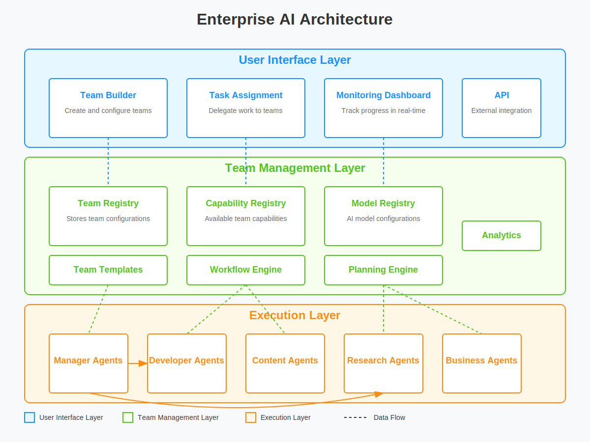

# **Enterprise AI** 🚀

### **The Future of Automated Workforces**

Enterprise AI is a **multi-agent artificial intelligence platform** designed to create autonomous AI teams that can efficiently collaborate to execute complex tasks. I just start this project.



### **Key Features**

✅ **Hierarchical AI Teams** – Manager & specialized agents for structured workflows\
✅ **Role-Based Specialization** – Agents with domain-specific expertise (e.g., Development, Research)\
✅ **Workflow Orchestration** – Seamless multi-agent coordination\
✅ **Multi-Tool Integration** – Equipped with specialized tools\
✅ **Secure Execution** – Isolated environments for safe code execution

### **Installation & Setup**

```bash
# Clone the repository
git clone https://github.com/EngineerProjects/Enterprise-AI.git
cd Enterprise-AI

# Set up the virtual environment and install dependencies
make setup
make install
```

### **Usage**

```bash
# Run tests
make test

# Format & lint code
make format && make lint
```

### **Roadmap**

- 🔹 Implement AI Team Collaboration Engine
- 🔹 Expand Tool & Workflow Capabilities
- 🔹 Optimize Performance & Scalability

### **Contributing**

Pull requests are welcome! Please check the contribution guidelines before submitting changes.

______________________________________________________________________

This is **clean, simple, and informative**—perfect for your first commit! 🚀
